# Computernetwerken Labo 4: sockets

## 3. Opdracht server ports

### 1. Bekijk welke poorten er allemaal actief zijn op jouw VM. Stop de DNS daemon bind9, en bemerk het verschil. Welke poorten gebruikt de DNS daemon allemaal?

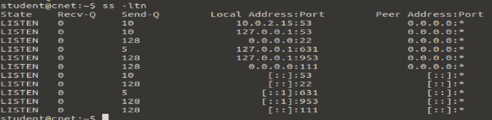

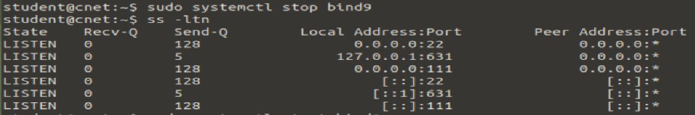

2 x 53, 2x 953 deze poorten staan niet meer open na het stoppen van bind. er zijn telkens 2 van de poorten, een voor elke IP versie
953 is voor BIND remote name daemon control (RNDC)

### 2. Verwijder het programma ‘cups-daemon’:

    apt purge cups-daemon

Welke poort was er in gebruik door de software (voor printer-services die we niet gebruiken)?
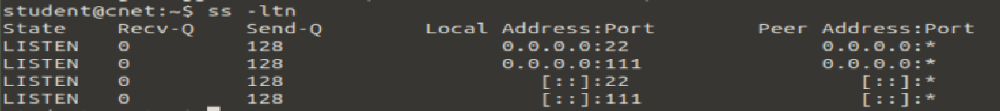\
2x 631, weer 1 voor elke IP versie

### 3. Installeer de software apache2. Kan je merken welke poort er actief geworden is?

80

### 4. Installeer de software nginx. Deze daemon wil echter niet opstarten. Leg uit waarom.

Omdat die ook poort 80 wil gebruiken maar die is al in gebruik door apache

### 5. Stel de poort van apache2 in op 8080 – dit kan via het bestand /etc/apache2/ports.conf. Herlaad deze daemon. Kan je de wijziging zien in je listening sockets? Zou je nu nginx kunnen opstarten? Leg uit.

In de listening sockets kan je zien dat er nu geluisterd wordt op poort 8080, dus nginx kan nu poort 80 gebruiken
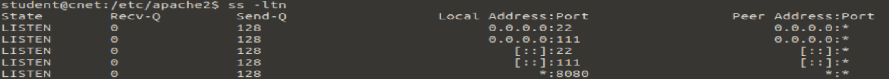

## 1. Opdracht: capture curl?

### 1. Start wireshark op binnen je VM, met sudo

    sudo wireshark

### 2. Terwijl je captured op de interface, vraag je met curl de ugent pagina op.

Zie je het HTTP/TCP gesprek horend bij deze applicatie?
ik zie het epische gesprek
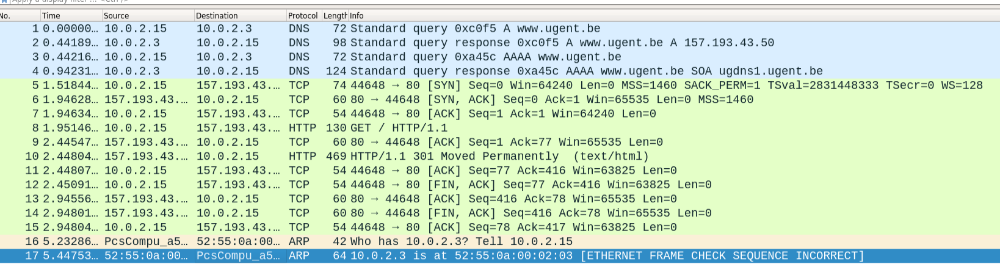

## 4. Opdracht actieve sockets

### 1. Maak een SSH verbinding naar home.test.atlantis.ugent.be ; bekijk voordien en nadien de uitkomst met ss –tn. Leg uit vanaf wanneer een poortnummer in gebruik is op een client.

Nadat de syn verstuurd wordt wordt het poortnummer voortbehouden\
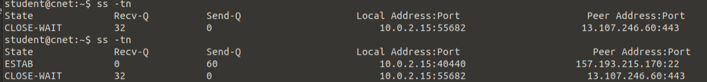

### 2. Maak nadien een tweede SSH verbinding vanaf dezelfde client. Leg uit a.d.h.v. het resultaat van ss hoe de pakketten van deze beide verbindingen door de computers uit elkaar kunnen gehouden worden.

De beide verbindingen kunnen uit elkaar gehouden worden door de verschillende proces id's\
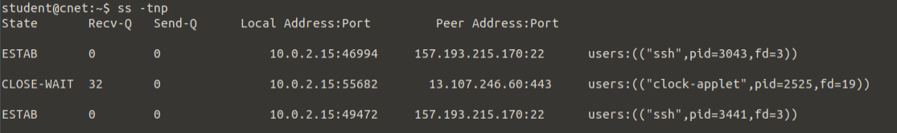

### 3. Bekijk de listening sockets op deze server. Leg van 3 poorten uit welke functie ze vervullen op de server. Hint: bekijk de inhoud van het bestand /etc/services.

### 4. Je installeerde reeds de nginx webserver. Kan je met netcat testen of hij werkt op jouw systeem? Hoe doe je dat? Kan je met wget het index.html downloaden?

### 5. Je installeerde reeds de apache2 webserver, en werkte het poortnummer bij. Kan je met netcat testen of hij werkt op jouw systeem? Hoe doe je dat? Kan je met wget het index.html downloaden?

### 6. Stel een poortnummer open op je computer (netcat listening socket), zodat je er vanuit een 2e terminal met netcat mee kan verbinden. Kan je dit combineren met input/output redirection (zie vorig labo), zodat je het bestand /etc/services kan sturen van de ene terminal naar de andere doorheen deze TCP socket? Hint: http://www.microhowto.info/howto/copy_a_file_from_one_machine_to_another_using_netcat

listen: netcat -v -l -p 6789 > out.txt\
verbind: netcat localhost 6789\
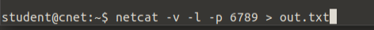

## 3. Opdracht python

### Implementeer beide stukken code in twee aparte python scripts. Pas de poort aan naar 6789. Pas eveneens het IP-adres van de client aan naar het (niet-localhost) IP-adres van jouw Linux VM. Start beide scripts op (in de juiste volgorde) vanaf de CLI. Krijg je onderstaande output?

student@cnet:~$ python3 tcp-client.py
Received b'Hello 10.0.2.4'
Eens je deze interactie kan uitvoeren:

### 1. Kan je het TCP gesprek capturen met WireShark? Op welke interface werk je?

sudo wireshark -i lo\
loopback interface
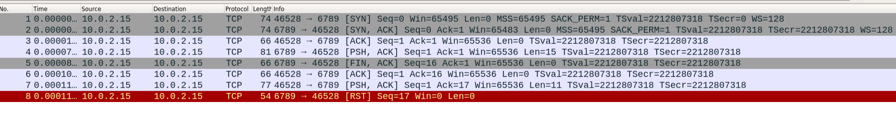

### 2. Kan je de server code aanpassen zodat hij het client poortnummer teruggeeft, i.p.v. het IP-adres van de client?

het 2de element van de addr array teruggeven, addr bevat namelijk een tuple van een ip en port\
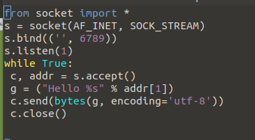

## Opdracht nmap

### 1. Voer een basisscan uit op scanme.nmap.org. Welke poorten zijn open? Welke poorten werden allemaal getest?

22, 80, 9929, 31337\
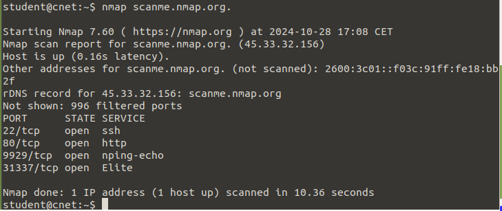

### 2. Voer een scan uit op de server home.test.atlantis.ugent.be. Welke poorten zijn er allemaal actief op deze server?

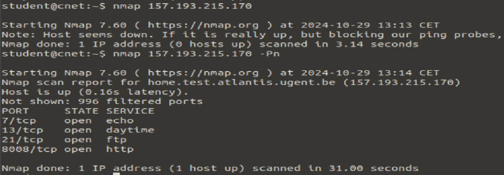

### 3. Start WireShark op, en start capturing. Scan met nmap je eigen Linux VM op poort 25. Stop het capturen. Welke status krijg je terug? Kan je dit linken aan de TCP-pakketten die je ziet?

nmap localhost -p25
je krijgt de status closed
in wireshark zie je na elke syn een RST SYN
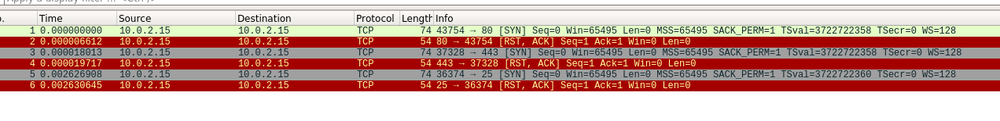

### 4. Herhaal dit experiment, maar test nu poort 25 op de server. home.test.atlantis.ugent.be. Welke status krijg je terug? Kan je dit linken aan de TCP-pakketten die je ziet?

de status is filtered, je ziet meerdere syn requests en daarna de RST SYN fragments na elkaar\
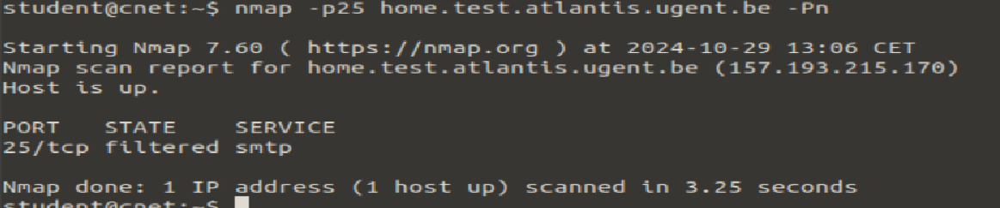
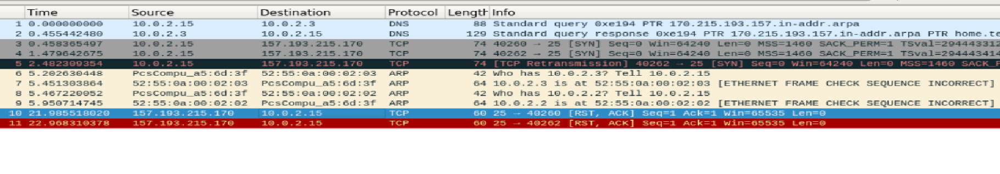

### 5. Na stap 3 en 4 zou je het onderscheid moeten kunnen maken tussen open en filtered als status. Voer een basis portscan uit op www.meemoo.be, en formuleer welk advies je zou kunnen geven aan de beheerder van de firewall van deze server.

open betekent dat de poort effectief aan het luisteren is, filtered betekent dat de firewall het tegenhoudt\
De beheerder moet http uitzetten!\
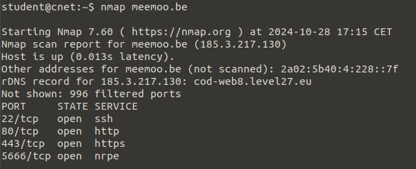
